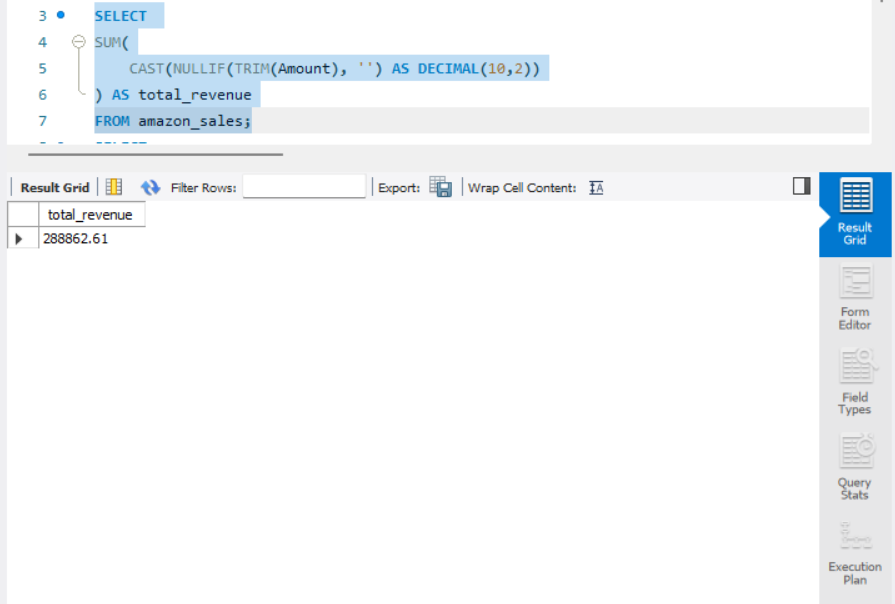
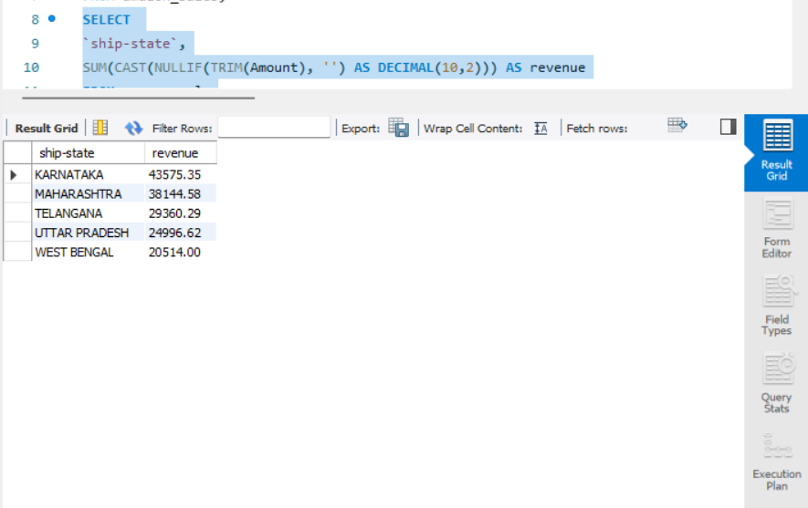
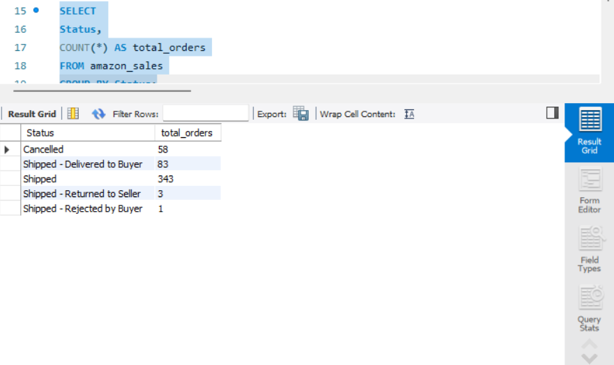
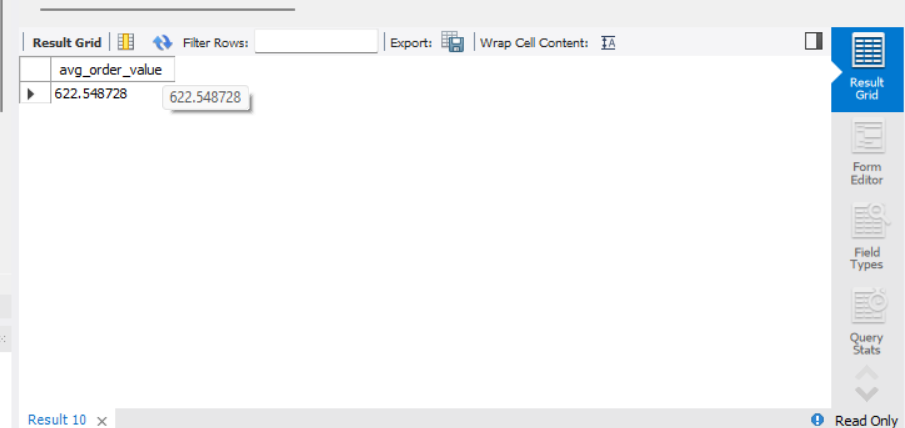
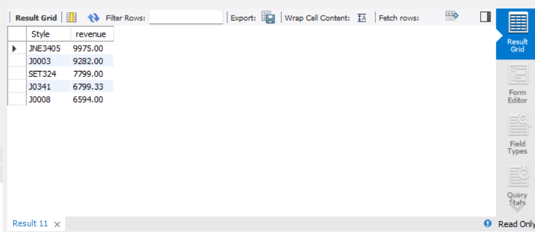
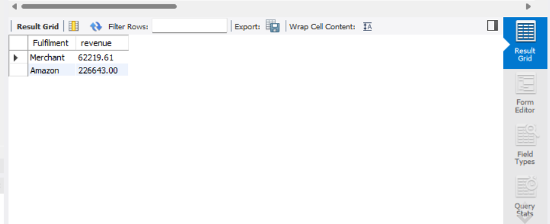

# SQL-Amazon-Sales-Analysis
✔ “Analyzed Amazon sales dataset using SQL by performing data cleaning, aggregation, and business analysis to extract insights on revenue, product performance, and regional trends.”
# 📊 Amazon Sales Data Analysis (SQL Project)

## 🔍 Overview
This project analyzes Amazon sales data using SQL to extract meaningful business insights such as revenue trends, top-performing products, and regional performance.

---

## 🛠 Tools Used
- MySQL
- SQL (Joins, Aggregations, Data Cleaning)

---

## 📂 Dataset
- Amazon Sales Dataset (CSV)
- Contains order details, product info, revenue, and location data

---

## 🧹 Data Cleaning
- Removed empty values using `NULLIF()`
- Trimmed spaces using `TRIM()`
- Converted data types using `CAST()`

---

## 📊 Key Insights
- 💰 Total Revenue: **288,862.61**
- 📍 Top States: Karnataka, Maharashtra, Telangana
- 📦 Most Orders: Shipped category dominates
- 📈 Avg Order Value: 622.54
- 🏆 Top Products: JNE3405, J0003

---

## 📸 Results

### 💰 Total Revenue

---

### 📍 Top States by Revenue

---

### 📦 Order Status Breakdown

---

### 📈 Average Order Value

---

### 🏆 Top Products by Revenue

---

### 🚚 Fulfilment Analysis

---

## 🚀 SQL Queries
All queries are available in:
queries.sql

---

## 🎯 Conclusion
This project demonstrates how SQL can be used to clean, analyze, and extract insights from real-world e-commerce data.

---

## 🔗 Author
**Mohd Zibran**

---

## ⭐ If you like this project
Give it a ⭐ on GitHub!
